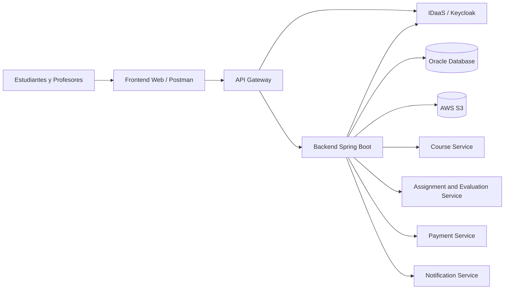

# Arquitectura de Microservicios - Plataforma de Aprendizaje

## 1. Contexto general

El sistema corresponde a una plataforma de aprendizaje en línea que permite gestionar usuarios, cursos, inscripciones y evaluaciones. Además, según los requerimientos del caso, la plataforma debe considerar funcionalidades como pagos, notificaciones y autenticación segura.

Actualmente el proyecto está desarrollado como una aplicación Spring Boot modularizada por dominios. Para efectos de la actividad, se complementa con una arquitectura basada en API Gateway, IDaaS y seguridad JWT. Esta propuesta permite separar las responsabilidades principales del sistema y facilita que cada componente pueda mantenerse, escalarse y modificarse de forma independiente.

## 2. Componentes y microservicios propuestos

Para cubrir los requerimientos del sistema se proponen componentes de arquitectura y microservicios principales:

- API Gateway
- IDaaS / Keycloak
- Course Service
- Assignment and Evaluation Service
- Payment Service
- Notification Service

Cada uno de estos servicios se encarga de una parte específica de la plataforma, evitando concentrar toda la lógica en un único componente.

## 3. Justificación general

La división en microservicios permite separar las funcionalidades críticas del sistema. Por ejemplo, la autenticación queda aislada de la gestión de cursos, y el procesamiento de pagos queda separado de las evaluaciones. Esto es importante porque no todos los módulos tienen la misma carga ni los mismos riesgos.

Además, esta arquitectura permite que en el futuro cada servicio pueda tener su propia base de datos, sus propias reglas de negocio y sus propios mecanismos de seguridad.

## 4. Comunicación entre servicios

La comunicación propuesta entre microservicios será mediante REST, utilizando intercambio de datos en formato JSON.

Se eligió REST porque es una alternativa simple de implementar con Spring Boot, es compatible con herramientas como Postman y permite que los servicios se comuniquen de forma clara mediante endpoints HTTP.

## 5. Responsabilidades de cada componente

| Componente | Responsabilidad principal | Entidades o datos asociados | Comunicación |
|---|---|---|---|
| API Gateway | Centraliza el acceso externo, valida tokens JWT y enruta las solicitudes hacia el backend. | Rutas `/api/**` | HTTP / REST |
| IDaaS / Keycloak | Gestiona autenticación y emisión de tokens JWT. | Realm, cliente, usuario, token | OAuth2 / OpenID Connect |
| Course Service | Administra cursos e inscripciones de estudiantes. | Curso, Inscripcion | REST |
| Assignment and Evaluation Service | Gestiona tareas, evaluaciones, entregas y calificaciones. | Evaluacion, Tarea, Calificacion | REST |
| Payment Service | Procesa pagos asociados a la inscripción en cursos. | Pago, MetodoPago | REST y servicios externos |
| Notification Service | Envía avisos automáticos sobre cursos, evaluaciones, tareas y pagos. | Notificacion | REST o eventos |

Esta separación permite que cada servicio tenga una responsabilidad clara. Además, evita que cambios en una funcionalidad afecten directamente a todo el sistema. Por ejemplo, una modificación en la lógica de pagos no debería alterar la gestión de cursos o evaluaciones.

## 6. Diagrama de arquitectura

En la implementación actual, el backend Spring Boot concentra la lógica de negocio de los módulos principales, mientras que el API Gateway actúa como punto único de entrada y Keycloak cumple el rol de proveedor de identidad. Esta estructura permite demostrar la integración entre API Gateway, IDaaS y Spring Security, manteniendo el diseño preparado para una futura separación física de los módulos en microservicios independientes.