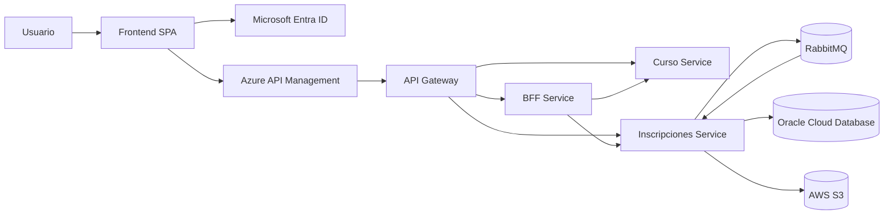

# Arquitectura de Microservicios - Plataforma de Aprendizaje

## 1. Contexto general

El sistema corresponde a una plataforma de aprendizaje en línea que permite gestionar usuarios, cursos, inscripciones y evaluaciones. Además, según los requerimientos del caso, la plataforma debe considerar funcionalidades como pagos, notificaciones y autenticación segura.

La plataforma utiliza una arquitectura distribuida compuesta por un frontend SPA, Azure API Management, API Gateway, BFF y servicios Spring Boot independientes. Microsoft Entra ID proporciona autenticación OAuth2/JWT, mientras RabbitMQ permite la comunicación asíncrona de los resúmenes de inscripción.

## 2. Componentes y microservicios

La plataforma se compone de los siguientes servicios y componentes principales:

- Frontend SPA
- Azure API Management
- API Gateway
- Microsoft Entra ID
- BFF Service
- Curso Service
- Inscripciones Service
- RabbitMQ
- Oracle Cloud Database
- AWS S3

Cada uno de estos servicios se encarga de una parte específica de la plataforma, evitando concentrar toda la lógica en un único componente.

## 3. Justificación general

La división en servicios separa las responsabilidades principales. Microsoft Entra ID gestiona la identidad, Curso Service administra los cursos, Inscripciones Service mantiene la lógica transaccional y el BFF coordina los flujos que requieren combinar varios servicios.

Cada servicio mantiene sus propias reglas de negocio y configuraciones, mientras el acceso se centraliza mediante Azure API Management y API Gateway.

## 4. Comunicación entre servicios

La comunicación síncrona entre servicios utiliza REST y JSON. El transporte asíncrono de resúmenes de inscripción se realiza mediante RabbitMQ.

REST permite exponer operaciones HTTP protegidas con OAuth2/JWT, mientras RabbitMQ desacopla la publicación, el consumo y la persistencia de los resúmenes.

## 5. Responsabilidades de cada componente

| Componente | Responsabilidad principal | Entidades o datos asociados | Comunicación |
|---|---|---|---|
| Frontend SPA | Proporciona la interfaz web y obtiene tokens mediante MSAL. | Sesión y operaciones del usuario | OAuth2 / REST |
| Azure API Management | Publica la API, valida tokens y reenvía solicitudes al API Gateway. | Operaciones GET, POST, PUT y DELETE | HTTPS / REST |
| API Gateway | Centraliza y enruta las solicitudes hacia los servicios internos. | Rutas `/api/**` | HTTP / REST |
| Microsoft Entra ID | Gestiona autenticación y emisión de tokens OAuth2/JWT. | Aplicaciones registradas, usuarios, scopes y tokens | OAuth2 / OpenID Connect |
| Curso Service | Administra el catálogo y CRUD de cursos. | Curso | REST |
| Inscripciones Service | Gestiona usuarios, inscripciones, evaluaciones, pagos, notificaciones, Oracle y S3. | Usuario, Inscripcion, Evaluacion, Pago, Notificacion | REST / JPA / S3 |
| BFF Service | Coordina la creación de inscripciones y la publicación y consumo de resúmenes. | DTO de inscripción y resumen | REST |
| RabbitMQ | Transporta los resúmenes entre productor y consumidor. | Cola, exchange y routing key | AMQP |
| Oracle Cloud Database | Almacena información transaccional y resúmenes consumidos. | Tablas de la plataforma | JDBC / JPA |
| AWS S3 | Almacena los archivos físicos de los resúmenes de inscripción. | Objetos organizados por número de resumen | AWS SDK |

Esta separación mantiene responsabilidades claras y permite modificar o desplegar cada componente sin concentrar toda la lógica en un único proceso.

## 6. Diagrama de arquitectura

El frontend obtiene los tokens de acceso mediante Microsoft Entra ID y consume las operaciones publicadas en Azure API Management. API Management valida el token y reenvía las solicitudes al API Gateway, que las dirige hacia el BFF, Curso Service o Inscripciones Service. El servicio de inscripciones se comunica con RabbitMQ, Oracle Cloud Database y AWS S3.